# Features

Below a list showing our major features.

## Basic Features

Many different tools to help with various problems.

## HUD and Information

Some HUD to make the game a little more fun.

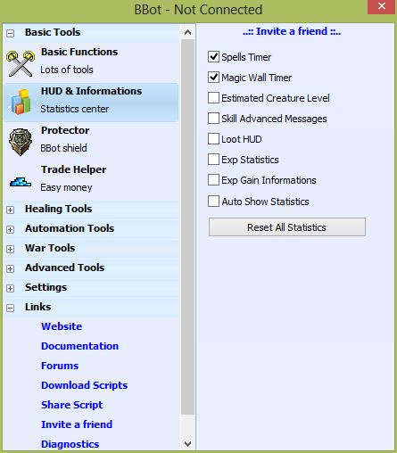

## Protector

You will need some help to sleep in peace.

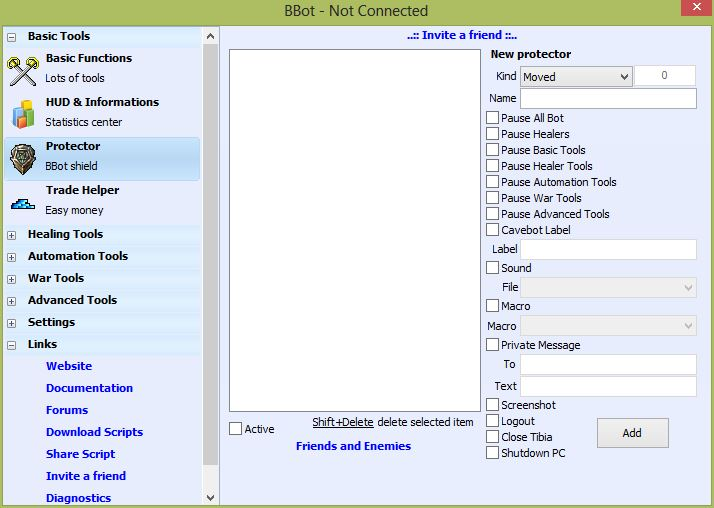

## Trade Helper

Advertising is the key to business.

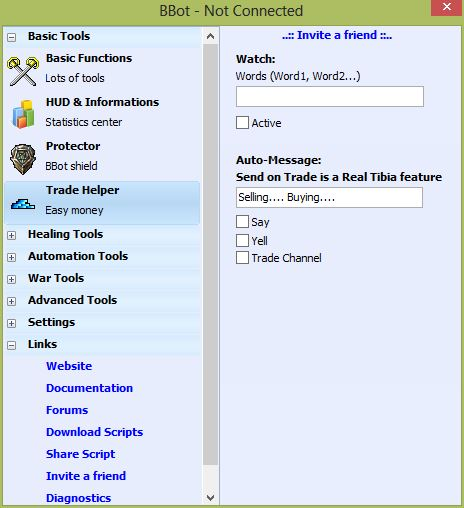

## Friend Healer

Keep your friends alive and have fun.

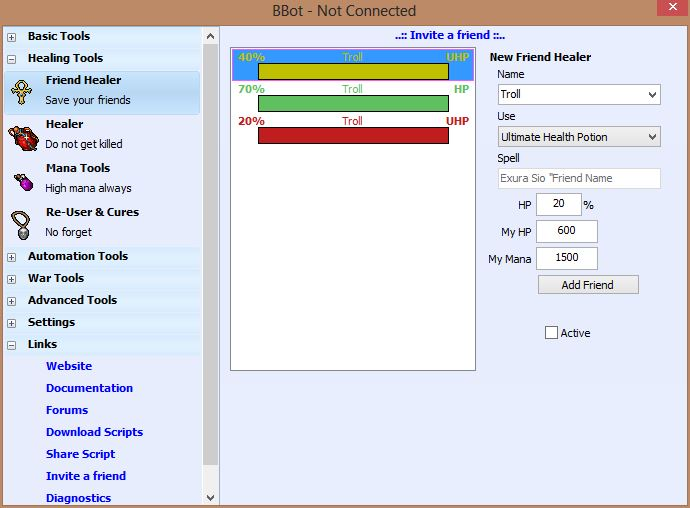

## Healer

Keep yourself alive, blessings are expensive.

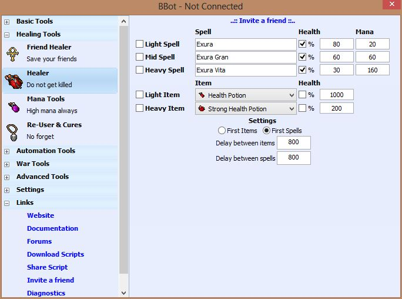

## Mana Tools

Forget your mana, focus on the good.

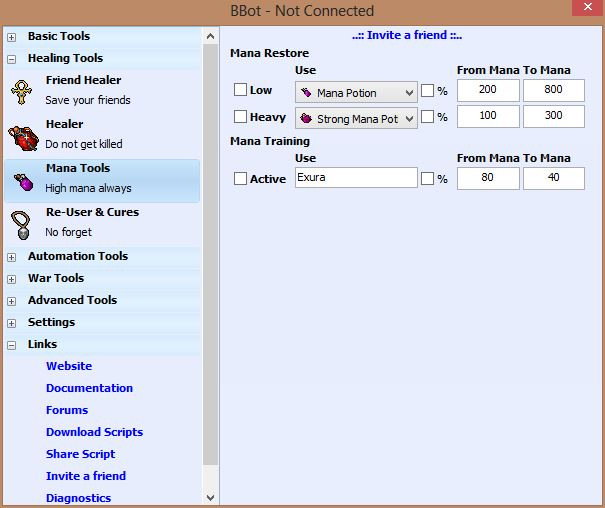

## Re-User and Cures

Make your spells never go off, and keep your inventory stuffed.

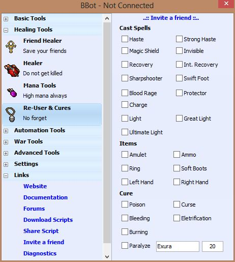

## Enchanter

Because making enchanted spears and runes can also be fun.

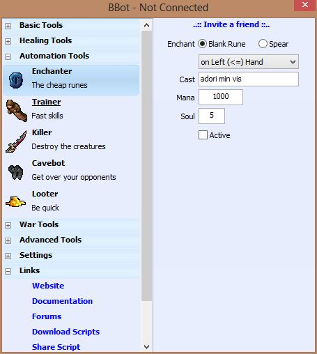

## Trainer

Offline-Training is not enough.

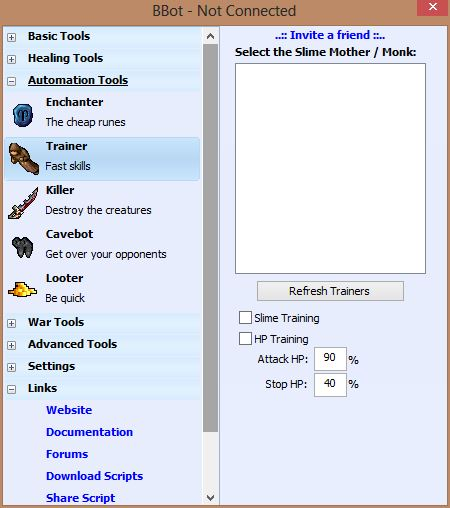

## Killer

For automating the attacking tasks.

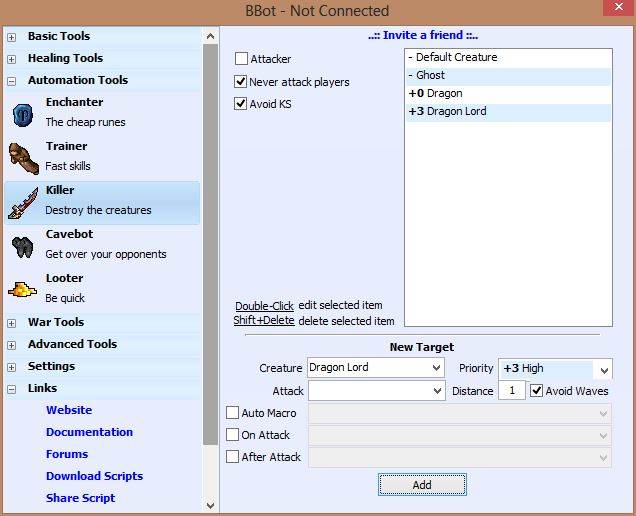

## Cavebot

Keep walking.

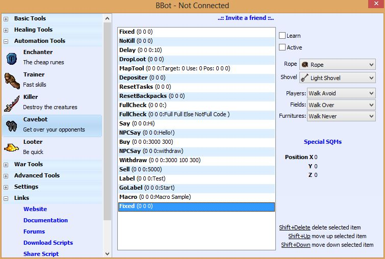

## Looter

Make money, become rich.

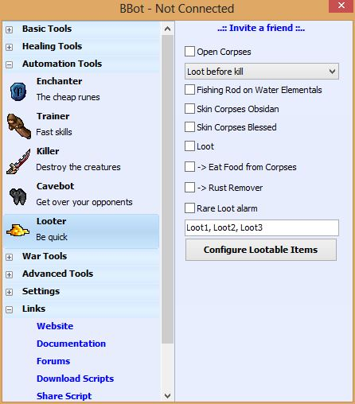

## Looting Configuration

Easy setup for the items you need.

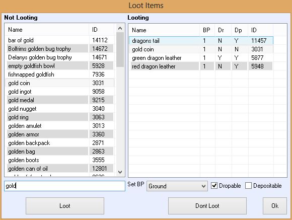

## Basic War

You may need some PVP tools to troll other people.

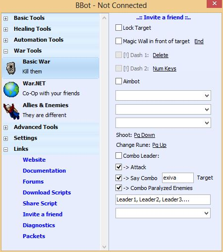

## War.NET

Working in team is more powerful than alone.

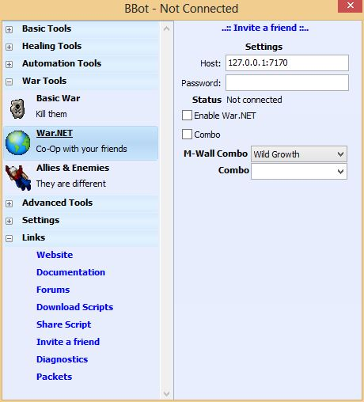

## Allies and Enemies

To distinguish good and evil.

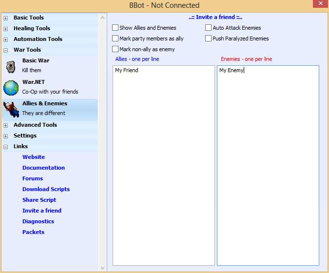

## Macros

Sometimes you will need something a little more advanced.

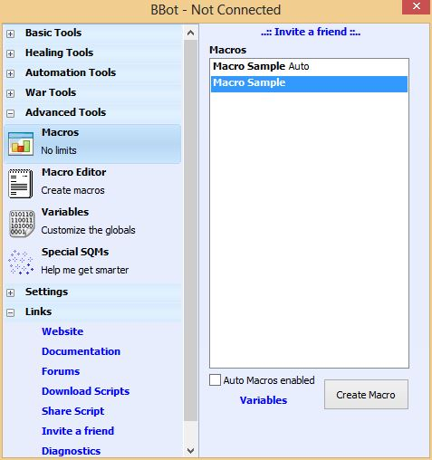

## Macro Editor

Helping you to extend the BBot.

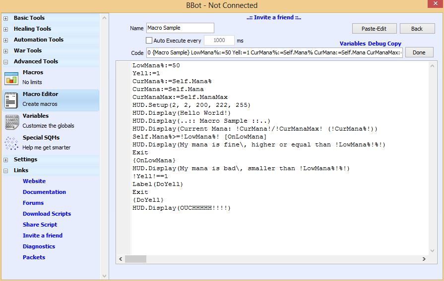

## Variables

To customize your scripts.

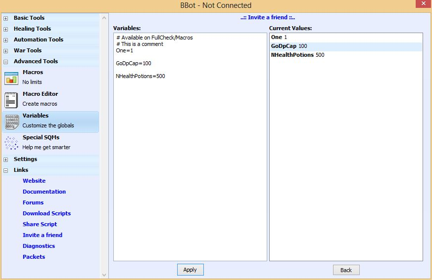

## Special SQMs

To teach the BBot where is good and where is bad.

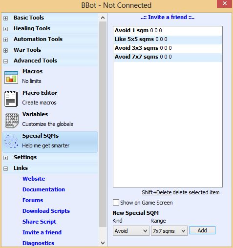
